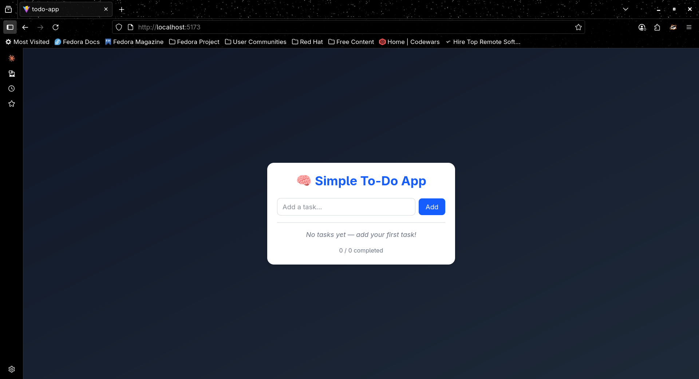
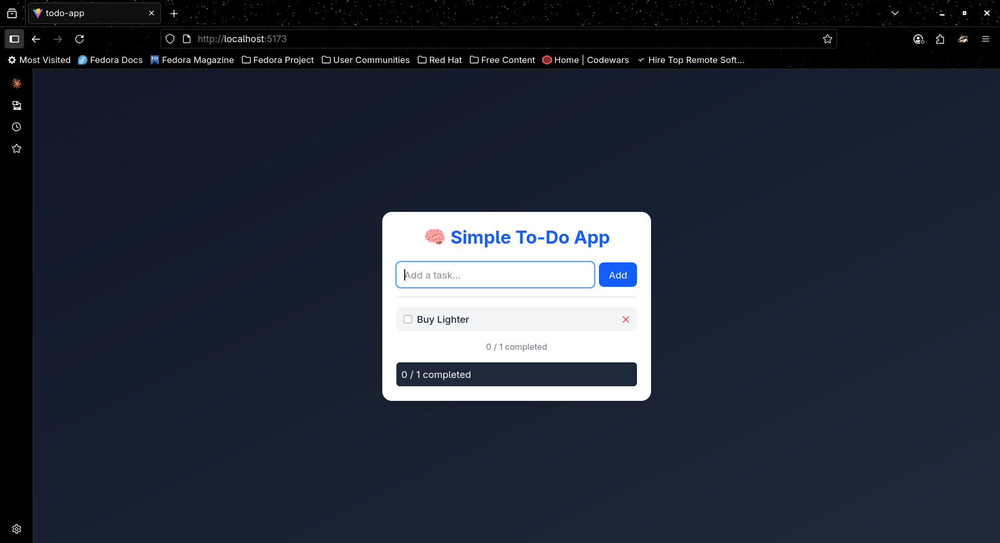
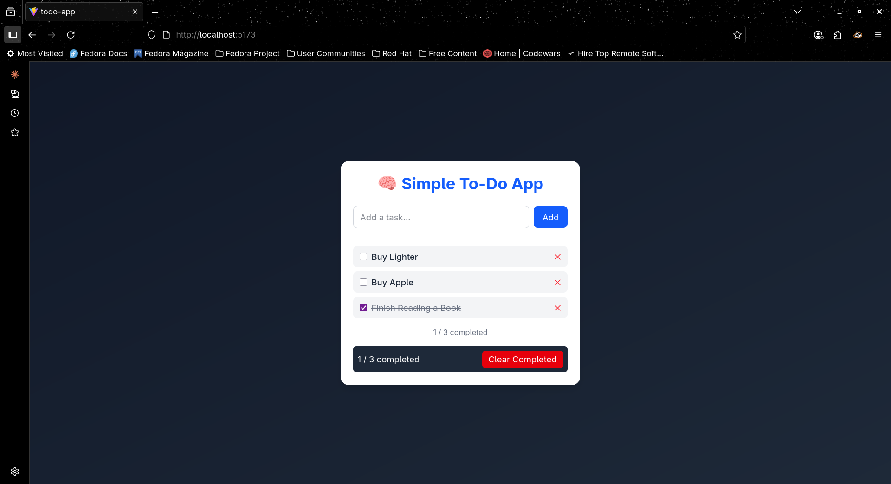
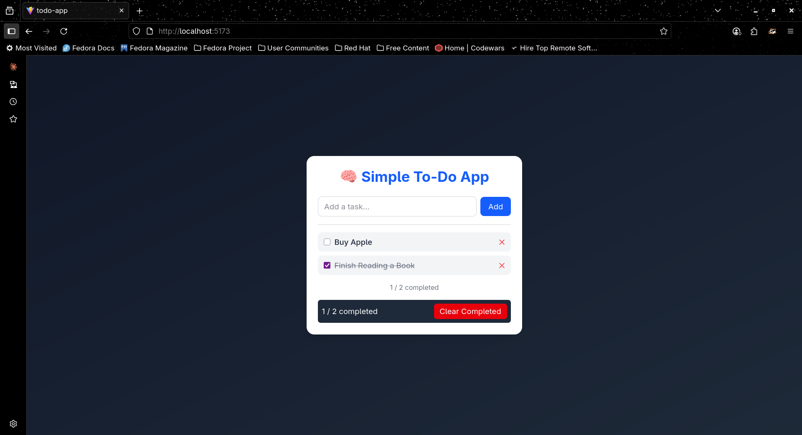

# 📝 Simple To-Do App (React + TypeScript + Tailwind)

A clean, responsive to-do list application built with **React**, **TypeScript**, and **Tailwind CSS**.  
Features local storage persistence, smooth UI interactions, and modern responsive design — perfect for portfolio demonstration.

---

## 🚀 Live Demo
🔗 **[View on Vercel](https://react-todo-typescript-plum.vercel.app/)**  

---

## ✨ Features

- ✅ Add new tasks instantly  
- ✅ Toggle task completion (with strikethrough effect)  
- ✅ Delete individual tasks  
- ✅ Clear all completed tasks  
- ✅ LocalStorage persistence (data survives refresh)  
- ✅ Responsive design with Tailwind CSS  
- ✅ Type-safe components using TypeScript  

---

## 🧠 Tech Stack

| Category | Technology |
|-----------|-------------|
| **Frontend Framework** | React 18 |
| **Language** | TypeScript |
| **Build Tool** | Vite |
| **Styling** | Tailwind CSS |
| **State Management** | React Hooks (useState, useEffect) |
| **Deployment** | Vercel |

---

## ⚙️ Installation & Setup

### Prerequisites
- Node.js ≥ 16  
- npm (or yarn/pnpm)

### Steps
```bash
# 1️⃣ Clone repository
git clone https://github.com/Uthso66/react-todo-typescript
cd react-todo-typescript

# 2️⃣ Install dependencies
npm install

# 3️⃣ Start development server
npm run dev
````

Then open **[http://localhost:5173](http://localhost:5173)** in your browser.

---

## 📂 Project Structure

```
src/
├── components/
│   ├── TodoInput.tsx      # Input field + Add button
│   ├── TodoList.tsx       # Renders todo items
│   ├── TodoItem.tsx       # Individual task component
│   └── TodoFooter.tsx     # Clear completed + task counter
│
├── types/
│   └── Todo.ts            # Type definitions
│
├── App.tsx                # Root component with localStorage logic
└── main.tsx               # Application entry point
```

---

## 🪄 Design Philosophy

* **Minimalist UX** — no clutter, just productivity
* **Color harmony** — dark background + white cards for contrast
* **Accessible** — keyboard-friendly, focus states, semantic structure
* **Lightweight** — no external state libraries or unnecessary deps

---

## 📦 Build for Production

```bash
npm run build
npm run preview
```

The production build will be created in the `dist/` directory.

---

## 🌍 Deployment (Vercel)

1. Push your code to a public GitHub repository.
2. Go to [vercel.com](https://vercel.com) → **New Project** → Import your repo.
3. Build command: `npm run build`
   Output directory: `dist`
4. Click **Deploy** 🚀

---

## 📸 Screenshots







```

---

## 🧾 License

This project is licensed under the **MIT License** — feel free to use, modify, and share.

---

## 👤 Author

**Md. Tarikul Islam (Uthso)**
Software QA Engineer | Security Enthusiast | AI/ML Learner
📧 [[tarikulislam.uthso.3966@gmail.com](mailto:tarikulislam.uthso.3966@gmail.com)]
🔗 [LinkedIn](https://www.linkedin.com/in/tarikul-islam-uthso/) | [GitHub](https://github.com/Uthso66)

